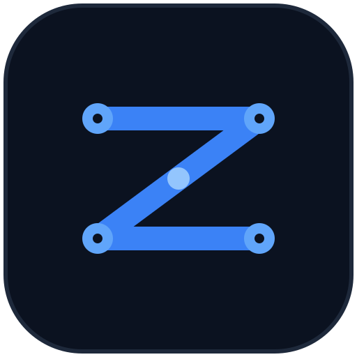
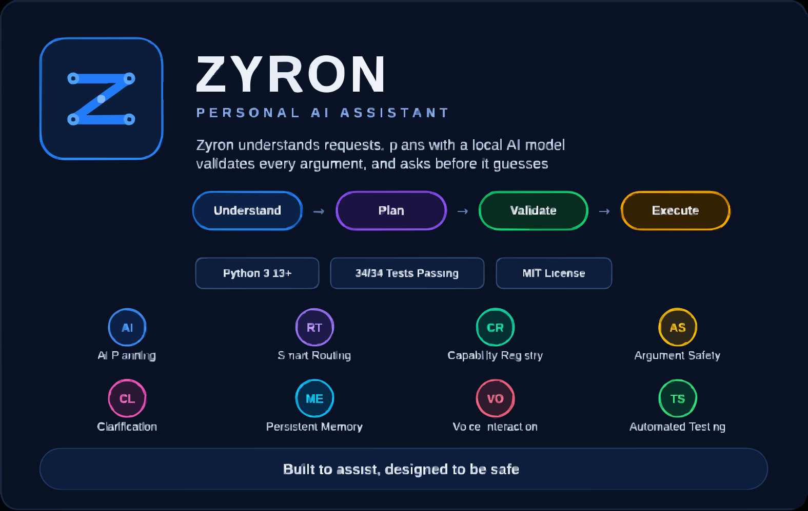

#  Zyron — A Local, Tool-Using AI Assistant

<p align="center">
  
</p>

<p align="center">
  <strong>A local-first AI assistant built around dynamic capability discovery, grounded arguments, safe tool execution, persistent memory, and voice interaction.</strong>
</p>

<p align="center">
  
  
  
  
</p>

---

## What is Zyron?

Zyron is a **from-scratch LLM tool-calling system** built in Python around a local Ollama model.

Instead of relying on an agent framework, Zyron implements its own:

- capability discovery
- tool registration
- parameter inference
- argument grounding and validation
- multi-turn clarification
- confirmation-based execution

The core principle is simple:

> **When information is missing, Zyron asks instead of guessing.**

---

## What This Project Demonstrates

| Area | Implementation |
|---|---|
| **LLM tool calling** | Hand-built plan → validate → execute flow using a local model |
| **Dynamic capabilities** | Planner works with registered capabilities instead of a large hard-coded command list |
| **Reflection-based design** | `ToolRegistry` derives parameter metadata from Python function signatures and type hints |
| **Argument safety** | Missing, unknown, and ungrounded arguments are checked before execution |
| **Safe execution** | Sensitive file operations require confirmation and overwrite protection |
| **Multi-turn interaction** | Missing arguments can be collected through follow-up messages |
| **Persistence** | SQLite-backed conversation history and explicit memory |
| **Testing** | 34 automated tests covering safety, clarification, routing, file/application behavior, and regressions |

---

## Architecture

```text
                         ┌──────────────────────┐
                         │         User         │
                         │     Text / Voice     │
                         └───────────┬──────────┘
                                     │
                                     ▼
                         ┌──────────────────────┐
                         │    Zyron Router      │
                         └───────────┬──────────┘
                                     │
                                     ▼
                         ┌──────────────────────┐
                         │     Zyron Agent      │
                         │ Planning · Grounding │
                         │      Validation     │
                         └───────────┬──────────┘
                                     │
                                     ▼
                         ┌──────────────────────┐
                         │    Tool Registry     │
                         │ Registered Capability│
                         └───────────┬──────────┘
                                     │
                    ┌────────────────┼────────────────┐
                    ▼                ▼                ▼
                 System            File             Web
                 Tools             Tools           Search
                    │                │                │
                    └────────────────┼────────────────┘
                                     ▼
                         ┌──────────────────────┐
                         │   Safety / Control   │
                         │ Validation + Confirm  │
                         └───────────┬──────────┘
                                     ▼
                         ┌──────────────────────┐
                         │      Execution       │
                         └───────────┬──────────┘
                                     ▼
                         ┌──────────────────────┐
                         │       Response       │
                         └──────────────────────┘
```

### Request Lifecycle

```text
User Request
     ↓
Capability Discovery
     ↓
AI Planning
     ↓
Argument Grounding
     ↓
Argument Validation
     ↓
Clarification if Required
     ↓
Confirmation if Required
     ↓
Controlled Execution
     ↓
Response
```

The important boundary is:

```text
AI Interpretation
       ↓
Application Validation
       ↓
Authorization / Confirmation
       ↓
Execution
```

The language model proposes a plan; the application decides whether that plan is valid and executable.

---

## Engineering Highlight: Automatic Parameter Inference

Zyron reduces manual tool-schema maintenance by inspecting Python function signatures.

```python
def _infer_parameters(self, function):
    parameters = {}
    signature = inspect.signature(function)

    for name, param in signature.parameters.items():
        if name in {"self", "cls"}:
            continue

        annotation = param.annotation
        param_type = {
            str: "string",
            int: "integer",
            float: "number",
            bool: "boolean",
        }.get(annotation, "string")

        parameters[name] = {
            "type": param_type,
            "required": param.default is inspect.Parameter.empty,
        }

    return parameters
```

This creates:

```text
Python Function
      ↓
Function Signature
      ↓
Tool Metadata
      ↓
AI Planning
      ↓
Argument Validation
```

The approach reduces duplicated schema definitions and lets the capability layer evolve with the Python functions.

---

## AI Planning & Dynamic Capabilities

Zyron uses **Ollama** with the `phi4-mini` model.

```text
Model: phi4-mini
Endpoint: http://localhost:11434/api/generate
```

The planner is constrained to registered capabilities and is instructed to:

- use only registered capabilities
- never invent capability names
- never invent parameter names
- never guess missing values
- use values grounded in the user's request
- leave missing required arguments absent
- request clarification when required information is missing

Example:

```text
User:
Calculate 10 multiplied
```

If `multiplier` is required, Zyron should ask for it rather than silently assuming a value.

---

## Clarification & Safe Execution

Zyron supports multi-turn clarification.

For example, if a capability requires:

```text
recipient
subject
body
```

and the user provides only:

```text
recipient = test@example.com
```

Zyron can respond:

```text
I need 'subject' and 'body' before I can use 'fake_action'.
Please provide them.
```

Sensitive operations such as:

```text
Write
Delete
Rename
```

require confirmation before execution.

For file writing, accidental overwrites are also protected unless overwrite is explicitly authorized through the confirmation flow.

> **A plan is not automatically authorization.**

---

## Persistent Memory

Zyron uses **SQLite** for local persistence.

It separates:

- conversation history
- explicit memories

Supported memory operations include:

```text
Remember
Forget
Forget by ID
Clear
```

The memory layer uses parameterized SQLite queries, and runtime data is excluded from version control.

---

## Voice Interaction

Zyron includes a local voice pipeline.

### Speech-to-Text

**Faster-Whisper** handles local speech recognition, including microphone input, speech detection, silence handling, audio validation, and transcription.

### Text-to-Speech

**Piper TTS** generates spoken responses.

Voice features are currently developed and tested on Windows and may require system-level audio dependencies.

---

## Web, System & File Capabilities

### Web Search

Zyron can use DuckDuckGo search results when current external information is required.

### System Information

Registered system capabilities can expose:

- CPU
- RAM
- disk
- battery
- date/time
- computer name
- system status

### Application Management

Applications are launched through a controlled allow-list rather than arbitrary executable paths.

### File Management

Supported operations include:

```text
Create
Read
Write
Delete
Rename
```

File operations include path-safety checks, with sensitive operations protected by confirmation.

---

## Technology Stack

| Category | Technology |
|---|---|
| Language | Python 3.13 |
| Local AI | Ollama + phi4-mini |
| AI Communication | Requests / HTTP |
| Speech-to-Text | Faster-Whisper |
| Text-to-Speech | Piper TTS |
| Database | SQLite |
| System Information | psutil |
| Audio Input | SoundDevice |
| Testing | PyTest |
| Version Control | Git & GitHub |
| Platform | Windows |

---

## Repository Structure

```text
Zyron/
├── assets/
│   ├── zyron-banner.svg
│   └── zyron-icon.svg
│
├── src/
│   └── zyron/
│       ├── ai/
│       ├── commands/
│       ├── core/
│       ├── main.py
│       ├── voice.py
│       ├── voice_assistant.py
│       ├── voice_input.py
│       └── whisper_input.py
│
├── tests/
│   ├── performance/
│   ├── regression/
│   ├── test_argument_safety.py
│   ├── test_clarification_e2e.py
│   ├── test_clarification_safety.py
│   ├── test_multi_argument_clarification.py
│   ├── test_required_argument_validation.py
│   └── test_router_regression.py
│
├── .gitignore
├── README.md
└── requirements.txt
```

---

## Testing

The latest full local test run:

```text
34 passed
0 failed
```

Run the full suite:

```bash
python -m pytest -q
```

Run with detailed output:

```bash
python -m pytest -v
```

Run argument-safety tests:

```bash
python -m pytest tests/test_argument_safety.py -v
```

Run multi-argument clarification tests:

```bash
python -m pytest tests/test_multi_argument_clarification.py -v
```

No GitHub CI pipeline is currently configured.

---

## Getting Started

### Prerequisites

- Python 3.13
- Git
- Ollama
- `phi4-mini`
- Microphone for voice input
- Required audio dependencies for voice features

### Clone

```bash
git clone https://github.com/Mustaq7892/Zyron.git
cd Zyron
```

### Create Environment

```bash
python -m venv .venv313
```

Windows PowerShell:

```powershell
.\.venv313\Scripts\Activate.ps1
```

### Install Dependencies

```bash
pip install -r requirements.txt
```

### Prepare Ollama

```bash
ollama pull phi4-mini
```

Make sure Ollama is running.

### Run

```bash
python -m src.zyron.main
```

---

## Design Philosophy

### Local-First

Inference is designed around a locally running Ollama engine.

### Explicit Capabilities

The agent can only execute capabilities registered with the `ToolRegistry`.

### Grounded Arguments

Values should come from the user's request rather than being invented by the planner.

### Validate Before Execution

Plans and arguments are checked before execution.

### Clarify Instead of Guessing

Missing required information results in a clarification request.

### Confirmation for Sensitive Operations

Operations that modify the local environment require an additional confirmation step.

### Separate Planning from Execution

The AI interprets intent and proposes a plan; application logic determines what is valid and executable.

---

## Roadmap

- Improve capability discovery and planning reliability
- Separate planning, validation, clarification, and execution components further
- Centralize configuration and move settings toward environment variables
- Expand automated test coverage
- Add GitHub CI
- Improve voice interaction and memory management
- Extend beyond Windows
- Continue strengthening safety controls
- Add a polished terminal/demo recording
- Add a formal open-source `LICENSE` when ready

---

## Project Status

### Zyron v0.1 — Safe MVP

Zyron has reached a **stable, tested MVP checkpoint**.

The current foundation includes:

- local LLM planning
- dynamic capability discovery
- tool registration
- parameter inference
- argument grounding and validation
- multi-turn clarification
- confirmation-based sensitive operations
- controlled application execution
- controlled file operations
- SQLite-backed memory
- local speech recognition
- local text-to-speech
- web search
- automated testing

The project is currently **paused at this stable checkpoint** while the surrounding software engineering and data engineering portfolio is being developed.

---

## About Me

I'm **Shaik Mustaq**, a Software Engineer with over two years of professional experience building backend systems, working with data pipelines, and developing with Python and SQL.

Zyron reflects how I like to work: understanding a problem deeply enough to build it from first principles rather than reaching for the nearest framework.

Instead of relying on an existing agent framework, I built Zyron's planning, capability discovery, parameter inference, argument validation, clarification, and confirmation flow myself.

I build practical projects to strengthen my software engineering and data engineering skills through implementation.

<p align="left">
  <a href="https://www.linkedin.com/in/shaik-mustaq-915741254/">
    
  </a>
</p>

---

## License

A formal open-source license has not yet been added to the repository.

The project may be released under the **MIT License** in the future once the corresponding `LICENSE` file is added.

---

<p align="center">
  ⭐ If you find Zyron interesting, consider giving the repository a Star.
</p>
